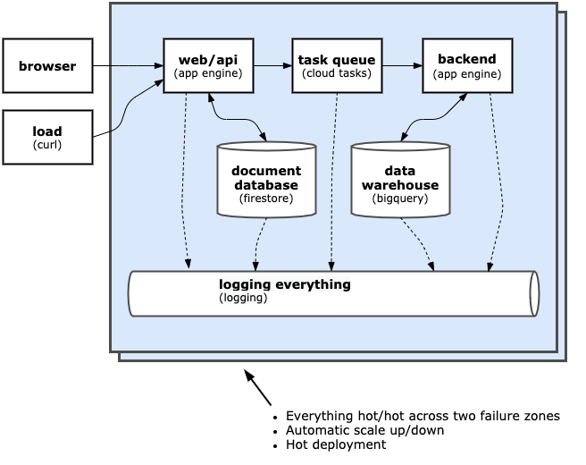

# GCP Serverless Project Demo

## Tutorial

The easiest way to understand how this application functions and to deploy a working version is to go to the Tutorial.
The tutorial will walk you through the steps and provide the commands to be able to deploy and test the application
using Google Cloud Shell.

Click on the button below to go to the tutorial.

[](https://ssh.cloud.google.com/cloudshell/editor?cloudshell_git_repo=https://github.com/mondo-mob/gcp-serverless-demo.git&cloudshell_workspace=/&cloudshell_tutorial=etc/docs/cloudshell_tutorial.md)

You will be asked to trust the repo (as it's not managed by Google). You will also be asked for your Github credentials
in order to download the code (as it's currently a private repo).

## Overview

If you'd prefer to set the app up manually, follow the instructions below.

This is a non-trivial serverless web application using NodeJS 10 and the following services:

- Web app server (App Engine)
- Task queue (Cloud tasks)
- Backend (App Engine)
- Document database (Cloud Firestore)
- Data warehouse (BigQuery)
- Logging (built into all services)

All aspects of the solution:

- Run hot/hot across 2 or more failure zones
- Automatically scale up and down to handle load
- Automatically manage hot deploy where relevant

The architecture of the app looks as follows:



# Installation & deployment using Google Cloud Shell

## Create a new project

**NOTE:**  Delete the project when you're done to avoid incurring unnecessary charges.  This setup will leave one 
instance running which is not an issue for demo, but may incur charges if you leave it running for a month :)

- Head over to [Google Cloud Console](https://console.cloud.google.com/)
- Sign in using a gmail or gsuite account
- Check [billing is enabled](https://console.cloud.google.com/billing)
  - This typically doesn't incur charges if you follow the note above.
  - If it's your first time, sign up for free credits, this enables billing.
  - Otherwise, set up a new billing account
- Create a [new project](https://console.cloud.google.com/projectcreate)
- Make a note of your **project ID** (this is not always the same as project name)
- When notification (top right) is done, navigate to the project using the "SELECT PROJECT" 

## Use Google Cloud Shell to clone and deploy

Launch the Google Cloud Shell (top right nav) - this will be your dev machine for the demo.

Check out the code (you will need to provide your GitHub credentials, as this is a private repository):

```
git clone https://github.com/mondo-mob/gcp-serverless-demo.git
```

Enable the serverless services (retry if prompted):

```
gcloud app create --region australia-southeast1
gcloud services enable cloudtasks.googleapis.com firestore.googleapis.com
gcloud firestore databases create --region=australia-southeast1  
```   

Deploy the app:

```bash
cd gcp-serverless-demo
gcloud app deploy
```

## Use the app

Navigate to http://{project-id}.appspot.com

Type something in, hit \<return\> and it should play it back to you once it's stored in the database

## Pseudo load test

To demonstrate App Engine auto-scaling, you can run:

```bash
seq 1000 | parallel -i -j 60 curl -s -o /dev/null -w "{}:" "https://<PROJECT_ID>.appspot.com/test?load={}"
```

Note: on a Mac, you may need to install `parallel` which can be done by running the command:

```bash
brew install parallel
```

# Local dev

To run the app locally:

- Follow the instructions [here](https://cloud.google.com/docs/authentication/getting-started) to download a service 
  account credential file and save in the local directory as `credentials.json` 
- Install npm dependencies: `npm i`
- Run the application on port 8080: `GOOGLE_APPLICATION_CREDENTIALS=./credentials.json npm start`

